# Tugas 9 dan 10 Praktikum Mobile

Nama: Reyno Alfarez Marchelian </br>
NIM: H1D022111 </br>
Shift B

# TUGAS 9
## Penjelasan Login

1. Saat login, aplikasi akan memanggil layanan Firebase Authentication yang memungkinkan user untuk login menggunakan Google Sign-In
2. User akan diarahkan ke pop-up halaman login akun Google, kemudian Firebase akan menerima token authentication dari Google yang akan divalidasi Firebase dan kemudian akan membuat authentication session untuk user yang baru saja login
3. User berhasil login dan akan di-redirect ke /home

## Penjelasan Tampilan Data User

Data akun Google user (username, email, dan foto profile) akan ditampilkan pada halaman /profile menggunakan kode-kode berikut yang terdapat pada file ```ProfilePage.vue```

1. Profile Picture
```
<div id="avatar-container">
  <ion-avatar>
    
  </ion-avatar>
</div>
```

2. Username
```
<ion-item>
  <ion-input label="Nama" :value="user?.displayName" :readonly="true"></ion-input>
</ion-item>
```

3. Email
```
<ion-item>
  <ion-input label="Email" :value="user?.email" :readonly="true"></ion-input>
</ion-item>
```

## Screenshot Login Page
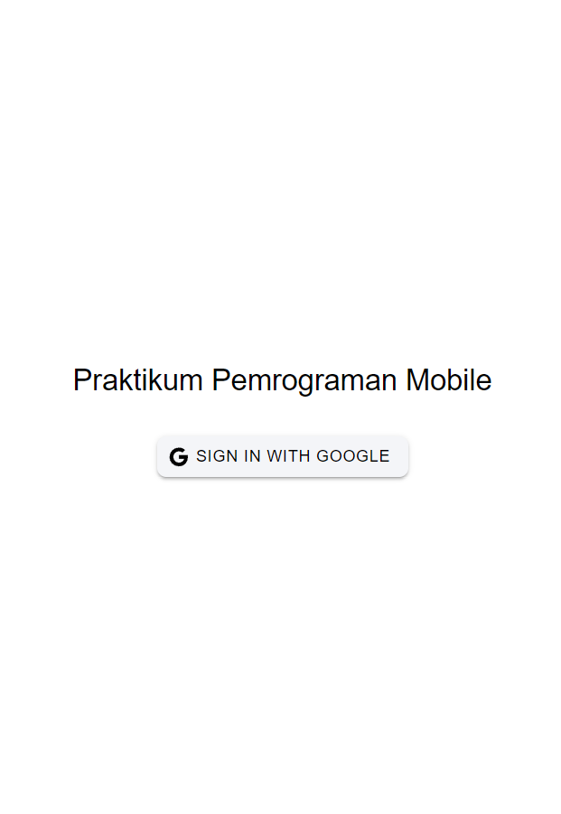 </br>

## Screenshot Profile
Note: Profile picture email saya memang hitam polos seperti itu, bukan karena gagal menampilkan foto </br>
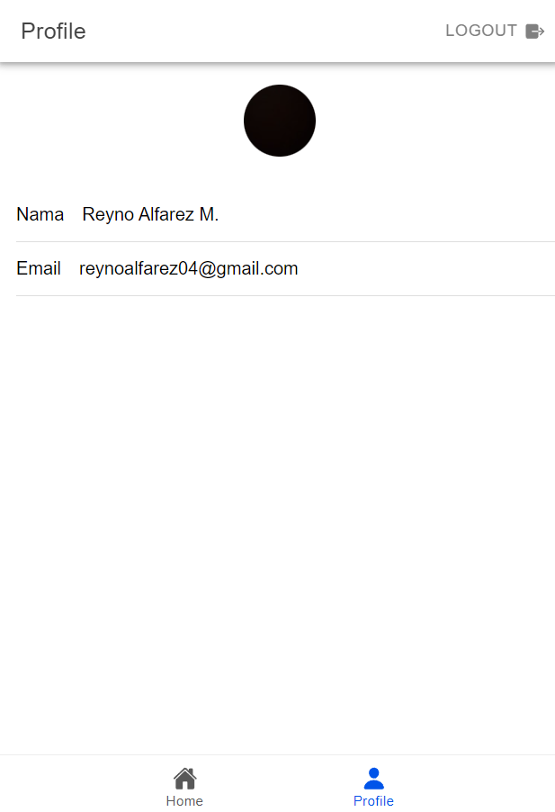

# TUGAS 10
## Penjelasan CRUD
1. Tampilan Awal List To-Do
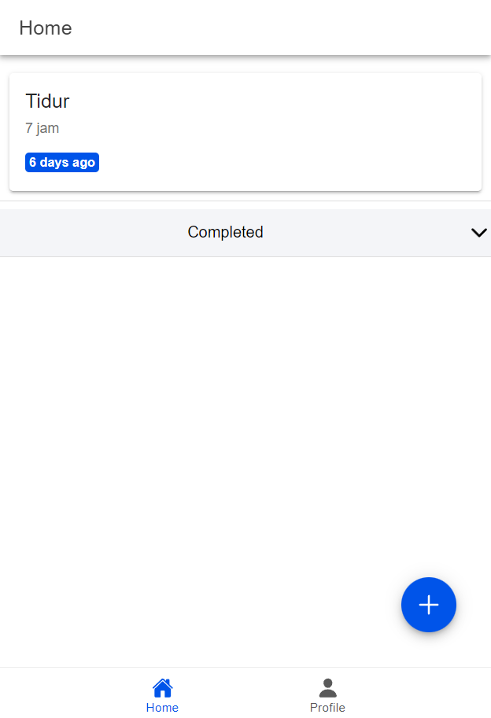

2. Add To-Do
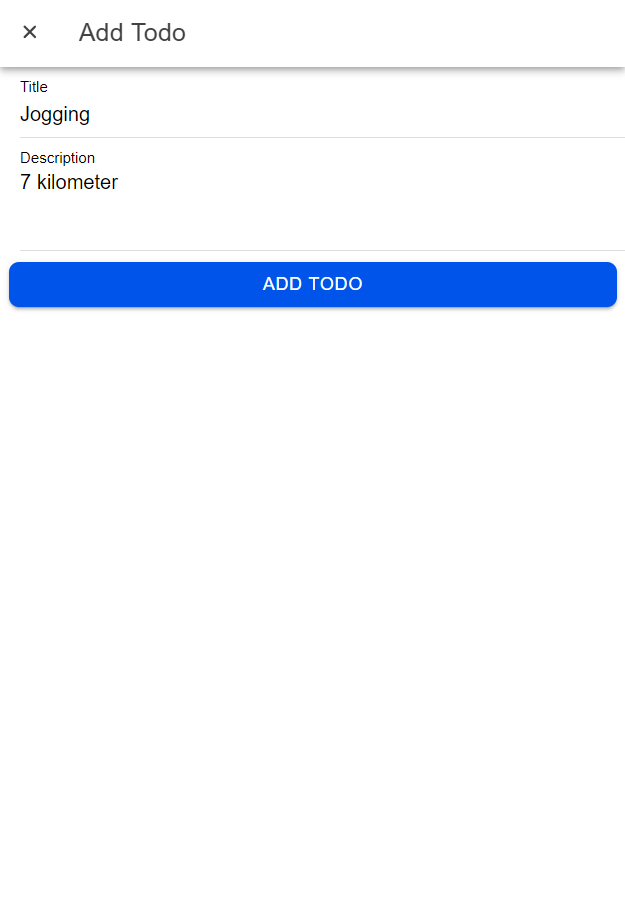
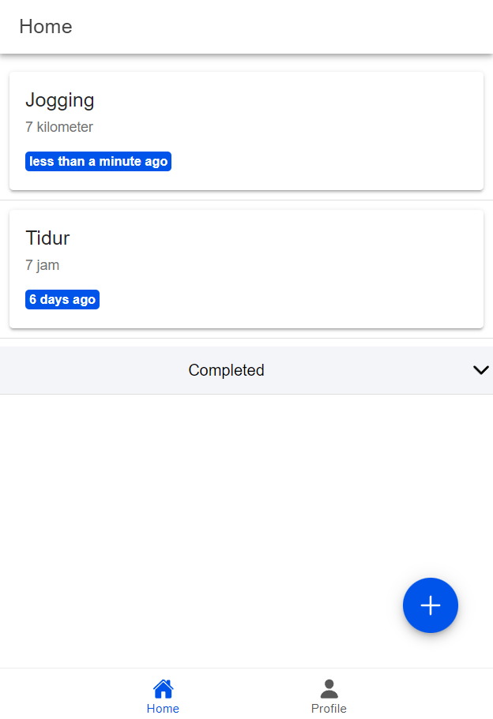

3. Edit To-Do
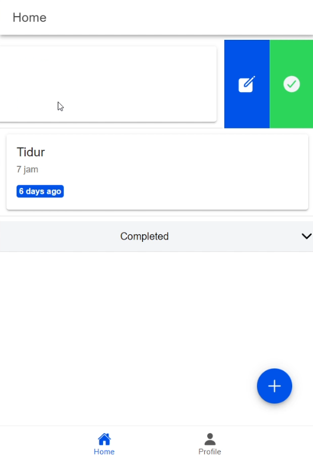
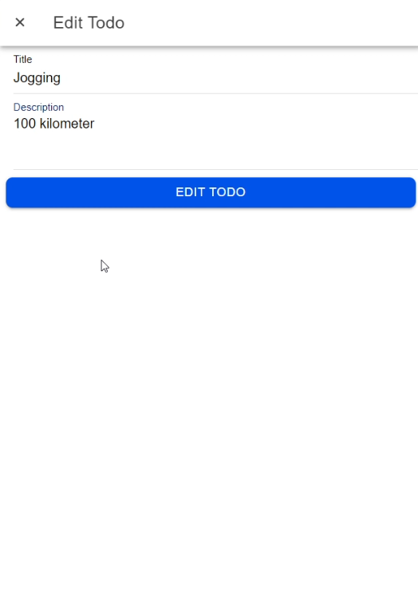
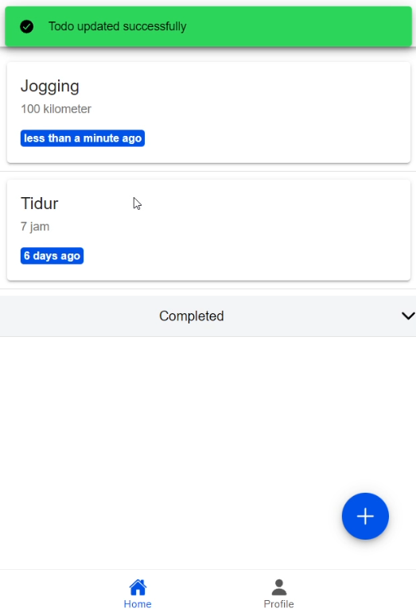

4. Mark To-Do as Completed
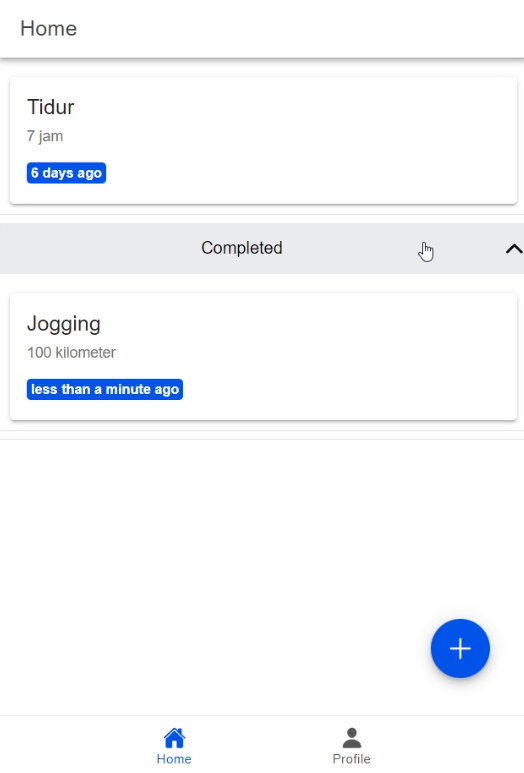

5. Delete To-Do
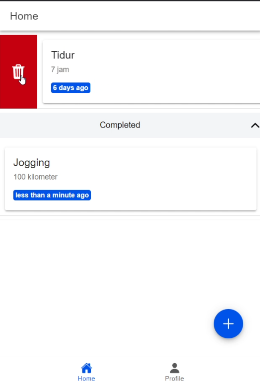
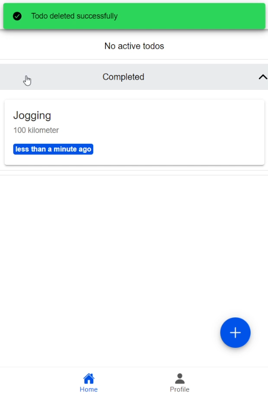

## Cara Membuat APK dari Proyek Ionic
1. Jalankan command berikut untuk menginstall package platform Android
```
ionic capacitor add android
```

2. Jalankan command berikut
```
ionic build
```
Kemudian, perangkat akan membuka Android Studio

3. Tunggu sampai loading selesai

4. Jalankan command berikut untuk menginstall dependencies aplikasi
```
ionic capacitor sync android
```

5. Generate key SHA1 yang akan digunakan untuk menyambungkan aplikasi ke Firebase dengan cara command berikut pada directory `/android`:
```
./gradlew signingReport
```
Kemudian, di terminal akan muncul data-data yang dihasilkan, termasuk key SHA1

6. Tambahkan app Android pada Firebase Console
    1. Buka Firebase Console
    2. Buka 'Project Settings'
    3. Di section 'Your apps', klik "Add app"
    5. Tambahkan aplikasi Android dengan memilih logo Android
       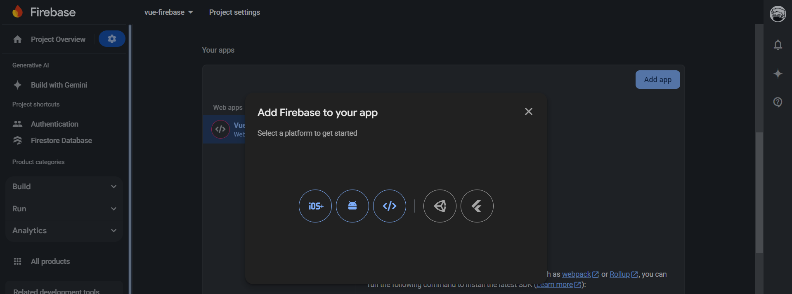
    6. Ikuti langkah-langkah yang disajikan, isi kolom "Android package name" dengan `app_id` yang ada di file `capacitor.config.ts`, kemudian masukkan key SHA-1 yang sudah diberikan sebelumnya di kolom SHA-1
       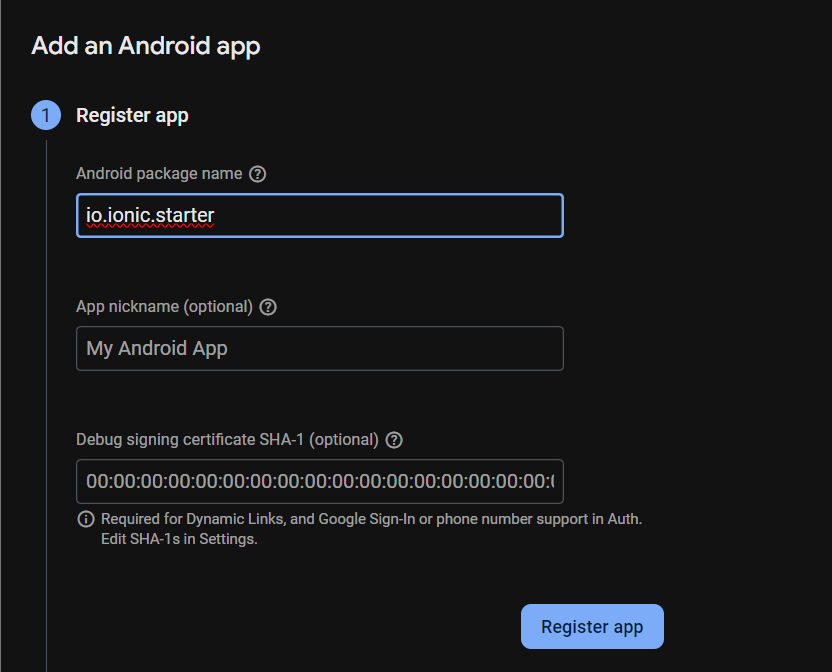
    8. Klik "Register app"
    9. Lanjut ke step berikutnya, download file `google-services.json`, kemudian taruh file tersebut di direktori `android/app`
       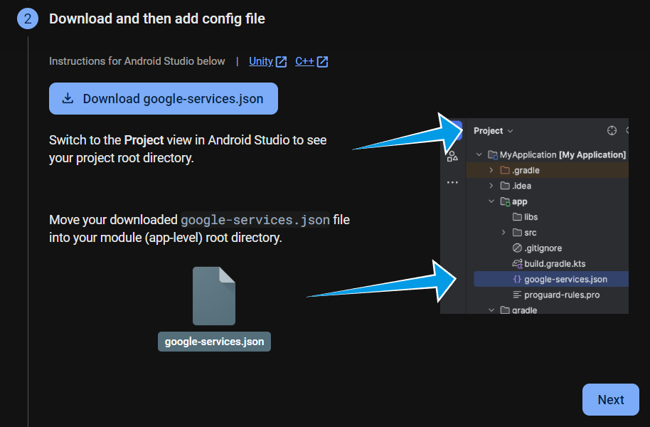
       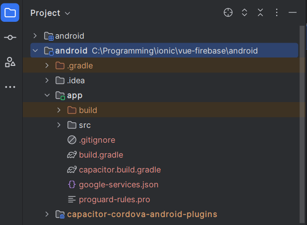

7. Kembali ke Android Studio, pilih menu `Build` > `Build App Bundle(s) / APK(s)` > `Build APK(s)`
   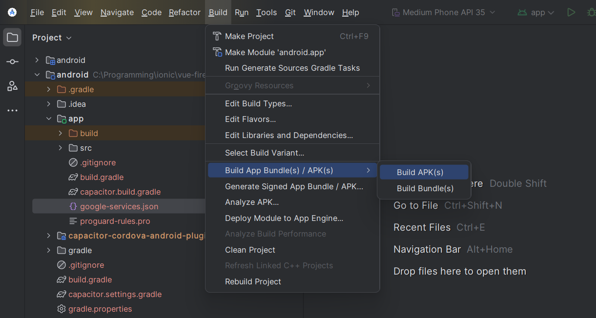

9. Android Studio akan membuat file APK, yang kemudian dapat ditemukan di direktori `android\app\build\outputs\apk\debug` dengan nama `app-debug.apk`

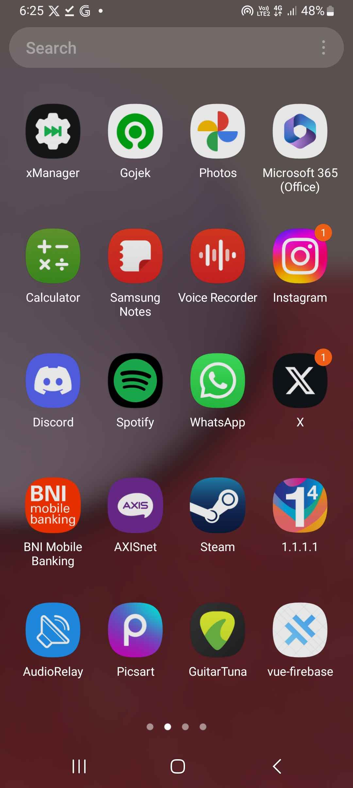
